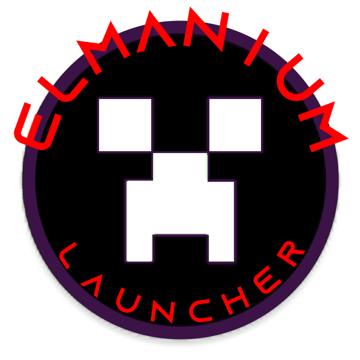

<h1 align="center">ElmaniumLauncher</h1>

### **<ins>
Fonctionnalitées du launcher :
**

- ✅ Mise à jour automatiques via github.

- 🔴 Option pour mettre le launcher en maintenance.

- 🔒 Authentification Microsoft/Monjang.

- 🏴‍☠️ Authentification Crack.

- ⛏️ Supporte toutes versions de Minecraft 1.0 > 1.19.x (Forge, Fabric etc).

- 📦 Supporte les version moddées Forge et Fabric (Pas les MCP)
 
- 📰 Fil d'actualité intégré nativement au launcher.

- 🚹 Gestionnaire de skins.

- ⚙️ Gestion intuitive des paramètres, y compris un panneau de configuration Java.

- 🟢 Statut serveur complet.

    - Opérationnel ou hors ligne.
    
    - Nombres de joueurs connectés.

- ☕ Installation de Java automatique.

    - Si vous avez installé une version incompatible de Java, nous installerons la bonne pour vous.
    
    - Vous n'avez pas besoin d'avoir Java installé pour exécuter le launcher.